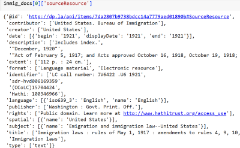
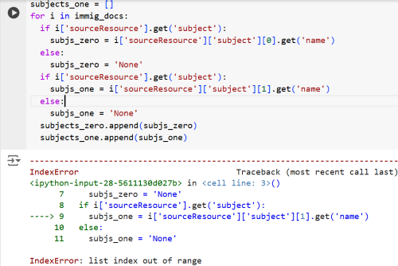
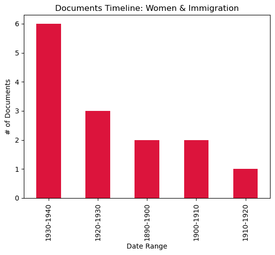

# The 1924 Project
## A Python Workflow for Immigration Restriction History
---
### Description & Rationale 
The main goal of this project is to create a workflow that can serve as a resource for obtaining historical data relating to immigration restrictions in the US. 

2024 marks the 100th anniversary of the creation of the discriminatory national origins quota system. Although the system was replaced after 1965, its legacy and those of earlier exclusionary policies echoes throughout current public discussions of immigration and racialized rhetoric towards migrants. 

To facilitate comparisons between past and present, workflows for extracting datasets of historical documents using Python are described in the project files. Ideally, they provide an additional tool beyond catalog searches to help researchers find resources documenting immigration restrictions.     

### Workflow
The general methodology is using the Python requests library to make API calls from archives or libraries that have relevant historical collections. Then, using the Pandas library to create a dataset, clean the data and analyze it to provide examples of the kinds of insights it can provide.

**Sources**

I identified several archives with large collections of digitized historical documents, including the [Digital Public Library of America (DPLA)](https://dp.la/browse-by-topic/immigration-since-1840) and the National Archives. Retrieving digitized documents was the focus in the belief that they’d offer richer information for users, such as images, URLs, subject headings and descriptions. 

Given time restrictions and the challenges of learning APIs from different institutions, for now I chose to work only with the DPLA, which has extensive and detailed [documentation for its API](https://pro.dp.la/developers/api-codex). 

**Querying** 

The first query used wildcard operators to search for documents about immigration (*or immigrants*) and law. Using the API’s temporal searching and pagination functionalities, the initial query was limited to 100 docs between the years 1880 and 1945, covering the period when most restrictions were created. 

A later version of this query expanded the document limit to 500, which became the dataset used in the analysis described below. 

```
import requests
url = 'https://api.dp.la/v2/items?q=immig*+AND+law*&sourceResource.date.after=1880&sourceResource.date.before=1945&page_size=100&api_key=7e794707ae677b5eb408334e9e6cc16e'
```
**Building the dataframe**

After parsing the json from the request object, the next step was deciding what fields to include in the dataframe. The `sourceResource` key within json contained most of the information I wanted and became the basis of the fields in the DataFrame (DF).



```
df = pd.DataFrame({
   'ID': ids,
   'Title': title,
   'URL': link,
   'Dates': date,
   'Locations': location,
   'Description': description,
   'Subjects': subjects,
   'Creator': creator,
   'Contributor': contributor
})
```

**Data Cleaning**

This was *easily* the biggest challenge and most time-consuming aspect of the project. Since the data was in dictionaries, I struggled to access the key:value pairs that would be most helpful for analysis, particularly subject headings and geographic locations. 

Subjects proved uniquely trying to work with. Most documents in the DF had subjects from their DPLA record, from as few as one to as many as 12 for a single record.
```
immig_docs[2]['sourceResource']['subject']
[{'name': 'Working class--Dwellings'}, {'name': 'Tenement houses--California'}]
```
Despite much toil, efforts to create separate columns in the DF for each individual subject or location were unsuccessful, and I had to settle for all the subjects and locations for a given document being lumped into one Subjects or Locations field.



For cleaning data I used the Pandas library, and was able to break the locations out into individual columns with the `string split()` method: 

```
df[['Location_one', 'Location_two', 'Location_three', 'Location_four', 'Location_five']] = df['Locations'].str.split(',', expand=True)
```

Converting each column in the DF to a string and then using the `string replace()` method was a helpful workaround for cleaning unwanted punctuation like dict brackets and quotation marks: 

```
df['Title'] = df['Title'].astype(str)
df['Title'] = df['Title'].str.replace('[', ' ')
```

Unfortunately the `string split()` method did not work for the subjects due to a repeated `ValueError: Columns must be same length as key`, forcing me to do the work in my CSV file instead. 

### Analysis 

Once the data was clean, I used Pandas and the Matplotlib graph plotting library to analyze it and create data visualizations. 

Given the query terms, the docs in the dataset mostly concern laws, debates about their passage and contemporary reports on them. Many of the docs were created by entities including Congressional committees and state representatives, thus primarily reflecting government perspectives. 

How can Python be used to analyze how these policies affected particular communities or groups of people? Whose “exclusions” are represented in this dataset?

One approach is illustrated below, employing the `string contains()` method to find variations of the term "Chinese" in subject headings (i.e. Chinese--Hawaii, Chinese American). 

```
chinese_excl = df['Subjects_grouped'].str.contains('Chinese', na=False)
```

It yielded a set of 37 docs relating to Chinese Exclusion (1882-1943) that can be used to create another DF for that topic. Since it contains other info including titles, descriptions, creators and URLs, the DF gives users all the data they need in one place, rather than cobbled together from catalog searches.

A slightly different method uses the DF apply() method to apply `string contains()`within a `Lambda` function. This searches *all* columns of the DF, and pulls additional docs with "Chinese" in fields other than Subjects, such as Title or Description.

```
Chinese_allcols = df.apply(lambda x: x.str.contains('Chinese', na=False), axis=1).any(axis=1)
```

A similar search for the immigration laws concerning women:

```
Women_allcols = df.apply(lambda x: x.str.contains('women', na=False), axis=1).any(axis=1)
```

A visualization of this search shows that most docs date between the 1920s-1940s, when the issue of citizenship status for American women married to "aliens" was debated in Congress.



### Future Directions

The code and methods outlined here can be a basis for further research within the DPLA's collections, or adapted for use with the APIs of other digital archives. Although the specifics of querying other institutions' APIs makes each pull different, the basic techniques of building DFs and using Pandas for analysis should be widely applicable.

Future users might consider building queries to find perspectives less well-represented in this dataset, namely those of communities and individuals impacted by these laws. Another possible direction is asking whose experiences are **not** represented here. For example, although restrictions also targeted immigration from Mexico and Southern Europe during this time period, that is not apparent in these docs.   

### Files List

- **immig_law_docs_500.csv** (uncleaned dataset of 500 docs)
- **1924proj_docs_clean.csv** (cleaned dataset)
- **OHagen_week9_challenge.ipynb** (Python notebook w/ API query)
- **1924_data_cleaning.ipynb**  (Python notebook showing data cleaning process)
- **1924proj_further_cleanup.ipynb** (Unsuccessful data cleaning attempts)
- **1924proj_analysis_draft.ipynb** (1st attempts at data analysis & visualizations)
- **1924Proj_analysis_final.ipynb** (cleaned-up data analysis & visualizations) 
